# Utilization Tool Zero (UTZ)

Utilization Tool Zero is a research instrument used for collecting system utilization data during computer science and cybersecurity experiments. 



## How It Works
* UTZ uses `psutil` to query CPU, RAM, Disk, and Network utilization.  
   
* UTZ outputs **memory used**, **disk free**, and then **cpu utilization** across all detected cpu cores.  
  
* Output is to shell as well as plaintext file.

## Installation and Requirements
#### Installation: 
`git clone git@github.com:jasonmpittman/utilization-tool-zero.git`

#### Requirements:

* Python 3.8.x
* psutil ( *pip3 install psutil* )

## Usage
```
cd utilization-tool-zero
python3 main.py
```

`ctrl+c` issues a `KeyboardInterrupt` and stops data collection.

## Options
Foremost, two `utz` class methods take an `amount` parameter as **KB**, **MB**, or **GB**. 

The three values will cause `ram()` and `disk()` to return total bytes in the indicated format. By default, those `utz` class methods will use **GB** if no parameter is supplied when called.

If you wish to have **KB** or **MB**, edit `main.py` on lines 32-34 and lines 42-44 as desired.

Further, the `utz` class reads a local `config.ini` which contains runtime options for:

* `cpu_interval` - the interval in seconds for polling CPU utilization
   * the default is `0.5` 
* `net_interface` - the NIC polled for network utilization
   * the default is `wifi0`

For more information or techincal details, please see the [psutil](https://psutil.readthedocs.io/en/latest/) documentation.

UTZ also has a configurable output file in the `config.ini`:

* `log` - name of the output file
   * the default is `output.log` 

## Acknowledgements
+ Taylor Lynch